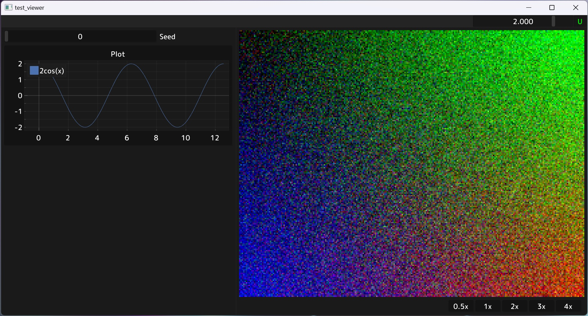

# PyViewer

Pyviewer is a python library for easily visualizing NumPy arrays and PyTorch tensors.

## Components

### single_image_viewer.py

A viewer for showing single fullscreen images without other UI elements. Runs in a ***separate process*** and remains interactive even if the main process is suspended (e.g. in a debugger). Great for interactively looking at intermediate values of complex ML/CG/CV pipelines.

### toolbar_viewer.py
A viewer that shows ImGui UI elemets on the left, and a large image on the right. Runs in the main process, but supports visualizing torch tensors directly from GPU memory (unlike single_image_viewer).

## Other features
* Bundles a custom build of PyImGui with plotting support (via ImPlot)
* Dynamically rescalable user interface
* Window resizing to integer multiple of content resolution

## Usage
See `examples/demo.py` for a usage example.