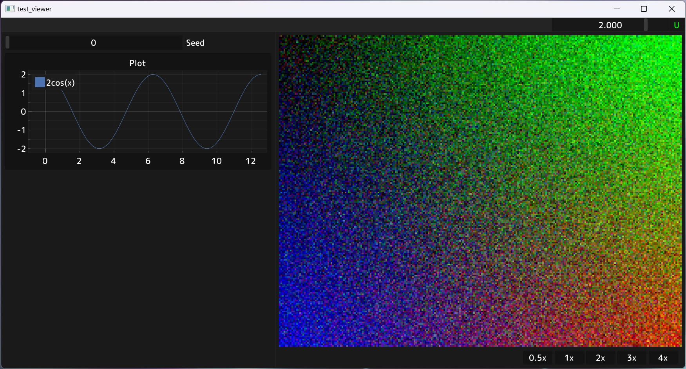

# PyViewer



Pyviewer is a python library for easily visualizing NumPy arrays and PyTorch tensors.

## Components

### single_image_viewer.py

A viewer for showing single fullscreen images or line plots without other UI elements. Runs in a ***separate process*** and remains interactive even if the main process is suspended (e.g. in a debugger). Great for interactively looking at intermediate values of complex ML/CG/CV pipelines.

Usage:
```
from pyviewer import single_image_viewer as siv
siv.draw(img_chw=np.random.randn(3,64,64))
siv.plot(np.sin(2*np.pi*np.linspace(0, 1, 10_000)))
```

### toolbar_viewer.py
A viewer that shows ImGui UI elemets on the left, and a large image on the right. Runs in the main process, but supports visualizing torch tensors directly from GPU memory (unlike single_image_viewer).

## Other features
* Makes use of [imgui-bundle](https://github.com/pthom/imgui_bundle) to provide plotting support and other extras
* Dynamically rescalable user interface
* Window resizing to integer multiple of content resolution
* Pan and zoom of the main image

## Installation
Install with `pip install pyviewer`. To use the optional Torch custom interop
operations, install `pip install 'pyviewer[custom-ops]'` so that the Ninja build
tool is available. <br>
Requires **Python 3.11+**.

### Nix

The development shell provides pyviewer and its Python dependencies as
Nix-managed packages:

```sh
nix develop
```

Python 3.12 is the default. Use `nix develop .#python311`, `.#python313`, or
`.#python314` to select another supported interpreter.

Build the package with `nix build`. The legacy `nix-shell` and
`nix-build default.nix -A pyviewer` entry points are also available.
Versioned flake packages such as `nix build .#pyviewer313` are provided for
Python 3.11 through 3.14. With the legacy shell, select a version with
`nix-shell --argstr pythonVersion 3.13`.

The package set can also be imported by another Nix expression:

```nix
pyviewerPackages = import /path/to/pyviewer {
  inherit pkgs;
  pythonPackages = pkgs.python312Packages;
};
```

Use `pyviewerPackages.pyviewer` in `python.withPackages`. The Nix package set
uses pinned upstream `imgui-bundle` wheels, currently available for CPython
3.11 through 3.14 on x86_64 Linux and x86_64/aarch64 macOS 14 or newer.

## Usage
See `examples/demo.py` for a usage example.

## API highlights
`PannableArea::screen_to_uv_xform`<br>
Maps absolute screen coordinates (e.g. `imgui.get_mouse_pos()`) to transformed image UVs, useful for picking etc.<br>

`PannableArea::uv_to_screen_xform`<br>
Maps image UVs to absolute screen coordinates. Useful when combined with imgui's [draw lists](https://pyimgui.readthedocs.io/en/latest/reference/imgui.core.html#imgui.core._DrawList).

`PannableArea::get_visible_box_image()`<br>
Returns the top-left and bottom-right UV coordinates of the currently visible image region.<br>

`PannableArea::get_hovered_uv_image()`<br>
Returns the image UVs that lie under the mouse cursor.

`PannableArea::get_hovered_uv_canvas()`<br>
Returns the *canvas* UVs that lie under the mouse cursor. Differs from the image UVs in case of non-matching image and window aspect ratios.

`from pyviewer.single_image_viewer import draw; draw(img_chw=...)`<br>
One-liner that opens a new viewer (unless already open) and draws the provided image. Runs in a separate process and thus works even when execution is halted by e.g. a debugger.
